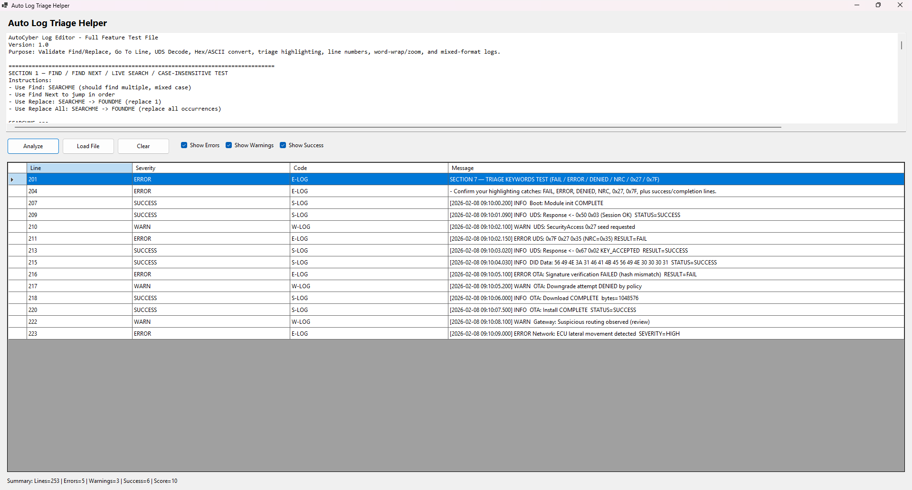

# AutoTriageSolution

AutoTriageSolution is a Windows-based diagnostic utility built in C# (.NET WinForms) for automated log triage and severity analysis.  
It reflects professional diagnostic, security, and operational tooling practices by separating analysis logic from presentation, enabling reuse, reliability, and long-term maintainability.

The application processes raw log data, identifies notable events, classifies severity, and presents structured results suitable for technical review and troubleshooting workflows.

## What’s New (TODO: version)

This release adds support for **CRITICAL** findings via the **Auto Triage Helper** in `AutoTriage.Core`.

- Added **CRITICAL** severity classification for stop-the-line conditions.
- Added a **Critical Findings** ruleset to detect high-risk indicators in automotive diagnostics and cybersecurity contexts.
- TODO: Add remaining release notes items once the final feature list is confirmed.

---

## Key Capabilities (This Release)

- Auto Triage Helper: **Critical Findings** detection
- **CRITICAL** severity classification and filtering

---

## Core Capabilities

- Load or paste raw log data
- Automated detection of ERROR, WARN, and SUCCESS events
- Severity classification and filtering
- Line-numbered, structured results view
- Summary scoring based on detected findings
- Deterministic, rule-based analysis (no UI coupling)
- Clean, code-first WinForms interface

---

## Architecture Overview

The solution is intentionally split into two projects to mirror production-grade tooling patterns.

### AutoTriage.Core (Class Library / DLL)

- Contains all log parsing and analysis logic
- Implements severity classification and domain models
- Produces structured analysis results independent of UI concerns
- Designed for reuse by other front ends (CLI, service, API, etc.)

### AutoTriage.Gui (WinForms Application)

- Handles user interaction and visualization
- Displays analysis results produced by the Core DLL
- Provides filtering, navigation, and presentation logic only
- Contains no analysis or classification rules

This separation ensures the analysis engine remains reusable, testable, and stable as interfaces evolve.

---

## Screenshots

### Main Interface with Loaded Logs

### Analysis Results with Severity Breakdown

### Cleared State / Fresh Session

---

## Running the Application

The application is distributed as a prebuilt Windows executable and does not require Visual Studio or a local build to run.

### Option 1: Run from GitHub Release (Recommended)

1. Navigate to the **Releases** section of this repository
2. Download the latest Windows x64 release ZIP  
   - TODO: Confirm exact ZIP name (example: `AutoTriageSolution_win-x64_vX.Y.Z.zip`)
3. Extract the archive to a local folder
4. Launch the application by running:

`AutoTriage.Gui.exe` (exact)

The release bundle includes all required runtime dependencies. No additional installation steps are required.

---

### Option 2: Run from Source (Development)

1. Clone the repository
2. Open `AutoTriageSolution.sln` in Visual Studio
3. Set `AutoTriage.Gui` as the startup project
4. Build and run using Release or Debug configuration

---

## Platform Requirements

- Windows 10 or later
- x64 architecture
- TODO: Confirm .NET Desktop Runtime version (example: .NET 8 Desktop Runtime), if applicable
- If using the Release ZIP: runtime dependencies are included (framework-dependent packaging)

---

## Distribution Notes

The executable is packaged as a framework-dependent Windows application.  
This mirrors common internal distribution practices for diagnostic, analysis, and security tooling in professional environments.

---

## Technologies Used

- C#
- .NET WinForms
- Class Library (DLL) architecture
- DataGridView
- Git & GitHub

---

## Project Status

This project is actively maintained as a professional diagnostic tooling example and portfolio artifact.  
The architecture and implementation are intentionally aligned with real-world analysis, diagnostics, and security tool design patterns.
